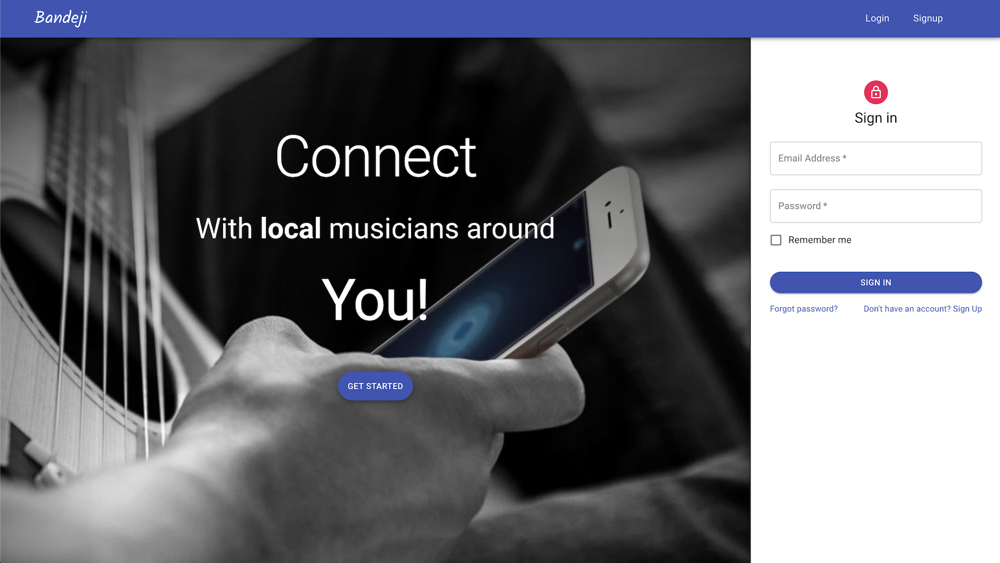

# Bandeji

---

## Description

### Bandeji is a web application to help local bands and musicians connect.

### On this app users can:

- Create an account as a group or as an individual.
- Individual members can:
  - Signup
  - View local listings for bands looking for musicians
  - Post listings as a musician looking for a band.
- Group members can:

  - Sign up,
  - Add and edit members to their group (band),
  - Create listings looking for musicians

---

## Prerequisites

- [npm](https://www.npmjs.com/get-npm)
- [NodeJS](https://nodejs.org/en/)
- [MySQL Workbench](https://www.mysql.com/products/workbench/)

---

## Installation

### Database:

In your MySQL Workbench run the code:

`DROP DATABASE IF EXISTS Pick_Up_Group_DB; CREATE DATABASE Pick_Up_Group_DB; USE Pick_Up_Group_DB;`

### Application:

On your command line, run the following commands:

- `Git clone git@github.com:sgutierrez-19/Bandeji.git`

- `npm install`

- `npm start`

---

## Authors

- **Pablo Motta** - [github profile](https://github.com/pablomotta)
- **Steven Gutierrez** - [github profile](https://github.com/sgutierrez-19/)

---

## Live App

[Click here to visit the live website.](https://bandeji.herokuapp.com/login)

---
